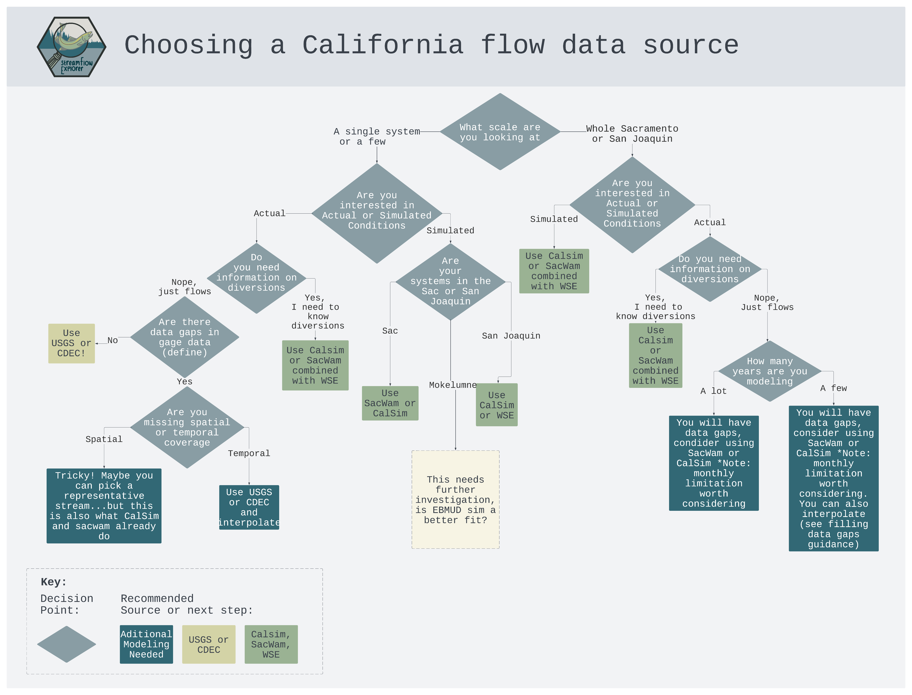

# streamFlowExplorer

Understanding Flows For Fish In California

## What is streamFlowExplorer?

StreamFlowExplorer is a data package developed by FlowWest and Metropolitan Water District to explore existing California empirical and modeled flow datasets. This package provides summaries describing the following California flow datasets and highlighting limitations for various use cases. This package explores the utility of these flow data for use in Salmonid population modeling.

**Empirical:**

-   [United States Geological Survey (USGS)](https://dashboard.waterdata.usgs.gov/app/nwd/en/?region=lower48&aoi=default)
-   [California Data Exchange Center (CDEC)](https://cdec.water.ca.gov/webgis/?appid=cdecstation)

**Modeled Datasets:**

-   [CalSim](https://water.ca.gov/Library/Modeling-and-Analysis/Central-Valley-models-and-tools/CalSim-3)
-   [SacWam](https://www.waterboards.ca.gov/waterrights/water_issues/programs/bay_delta/sacwam/)
-   [Natural Flow Database](https://rivers.codefornature.org/#/map)

## Install

To install the `streamFlowExplorer` data package, please use the remotes package to download from GitHub.

``` r
#install.packages("remotes")
remotes::install_github("flowwest/streamFlowExplorer")
```

## Flow Data Use Cases

The below tree displays a series of decision points and associated pathways to provide a guidance on what data type best fits your intended use case.



The following table provides a brief overview of the benefits and limitations of each data type for some potential use cases. Since this review is focused on flow data for ecological analysis this table primary focuses on that, but it also includes a few use cases for non ecological analysis since some of these datasets are primarly developed for non ecological purposes.

+---------------------------+---------------------------------+------------------------------------------------------------------------------------------------------------------+----------------------------------+-----------------------------------------------------------------------------------------------------------------------------------------------------------------------------------+-------------------------------------------------------------------------------------------------------------------------------------------+
| **Use Category**          | **Scale**                       | **Use Case**                                                                                                     | **Data Type**                    | **Benefits**                                                                                                                                                                      | **Limitations**                                                                                                                           |
+===========================+=================================+==================================================================================================================+==================================+===================================================================================================================================================================================+===========================================================================================================================================+
| Ecological Monitoring     | Single system/Regional Analysis | Studying the impact of streamflow changes on aquatic ecosystems                                                  | Empirical flow data (USGS, CDEC) | -   Fine resolution for modeling, provides hourly or daily flow data for a specific system                                                                                        | -   Availability and coverage varies by system, there are data gaps on some streams (data gaps make it challenging for regional analysis) |
|                           |                                 |                                                                                                                  |                                  |                                                                                                                                                                                   |                                                                                                                                           |
|                           |                                 |                                                                                                                  |                                  | -   Fine resolution is critical for biological modeling conditions                                                                                                                |                                                                                                                                           |
+---------------------------+---------------------------------+------------------------------------------------------------------------------------------------------------------+----------------------------------+-----------------------------------------------------------------------------------------------------------------------------------------------------------------------------------+-------------------------------------------------------------------------------------------------------------------------------------------+
| Ecological Monitoring     | Single system/Regional Analysis | Analyzing long-term trends in streamflow data to understand the effects of climate change on aquatic ecosystems. | Empirical flow data (USGS, CDEC) | -   Fine resolution for modeling, provides hourly or daily flow data for a specific system                                                                                        | -   Availability and coverage varies by system, there are data gaps on some streams (data gaps make it challenging for regional analysis) |
|                           |                                 |                                                                                                                  |                                  |                                                                                                                                                                                   |                                                                                                                                           |
|                           |                                 |                                                                                                                  |                                  | -   Fine resolution is critical for biological modeling conditions                                                                                                                |                                                                                                                                           |
+---------------------------+---------------------------------+------------------------------------------------------------------------------------------------------------------+----------------------------------+-----------------------------------------------------------------------------------------------------------------------------------------------------------------------------------+-------------------------------------------------------------------------------------------------------------------------------------------+
| Ecological Monitoring     | Regional analysis               | Analyzing long-term trends in streamflow data to understand the effects of climate change on aquatic ecosystems. | CalSim and SacWam                | -   Full coverage of system and no data gaps because it is modeled data                                                                                                           | -   Monthly timestep is limiting, misses critical flow events that may drive population dynamics                                          |
|                           |                                 |                                                                                                                  |                                  |                                                                                                                                                                                   |                                                                                                                                           |
|                           |                                 |                                                                                                                  |                                  | -   Can utilize different operations simulations to see how that changes ecosystem dynamics                                                                                       |                                                                                                                                           |
|                           |                                 |                                                                                                                  |                                  |                                                                                                                                                                                   |                                                                                                                                           |
|                           |                                 |                                                                                                                  |                                  | <!-- -->                                                                                                                                                                          |                                                                                                                                           |
|                           |                                 |                                                                                                                  |                                  |                                                                                                                                                                                   |                                                                                                                                           |
|                           |                                 |                                                                                                                  |                                  | -   Provides additional information on deliveries                                                                                                                                 |                                                                                                                                           |
+---------------------------+---------------------------------+------------------------------------------------------------------------------------------------------------------+----------------------------------+-----------------------------------------------------------------------------------------------------------------------------------------------------------------------------------+-------------------------------------------------------------------------------------------------------------------------------------------+
| Ecological Monitoring     | Single system                   | Hydraulic modeling for planning restoration project                                                              | Empirical flow data (USGS, CDEC) | -   Fine resolution for modeling, provides hourly or daily flow data for a specific system, may be important to plan how a project would react to different restoration scenarios | -   Availability and coverage varies by system, there are data gaps on some streams                                                       |
+---------------------------+---------------------------------+------------------------------------------------------------------------------------------------------------------+----------------------------------+-----------------------------------------------------------------------------------------------------------------------------------------------------------------------------------+-------------------------------------------------------------------------------------------------------------------------------------------+
| Ecological Monitoring     | Single system                   | Hydraulic modeling for planning restoration project                                                              | CalSim and SacWam                | -   Can utilize different operations simulations to see how that changes flow dynamics                                                                                            | -   Monthly timestep is limiting, misses critical flow events that may have an important impact on hydraulic modeling                     |
+---------------------------+---------------------------------+------------------------------------------------------------------------------------------------------------------+----------------------------------+-----------------------------------------------------------------------------------------------------------------------------------------------------------------------------------+-------------------------------------------------------------------------------------------------------------------------------------------+
| Water Resource Management | Regional analysis               | Assessing water availability for agriculture, urban use, and ecosystems.                                         | Empirical flow data (USGS, CDEC) |                                                                                                                                                                                   | -   Empirical data describes current conditions, it does not allow for testing various operations                                         |
+---------------------------+---------------------------------+------------------------------------------------------------------------------------------------------------------+----------------------------------+-----------------------------------------------------------------------------------------------------------------------------------------------------------------------------------+-------------------------------------------------------------------------------------------------------------------------------------------+
| Water Resource Management | Regional analysis               | Assessing water availability for agriculture, urban use, and ecosystems.                                         | CalSim and SacWam                | -   Built for testing various operations scenarios                                                                                                                                | -   Only avaliable for certain scenarios                                                                                                  |
|                           |                                 |                                                                                                                  |                                  |                                                                                                                                                                                   |                                                                                                                                           |
|                           |                                 |                                                                                                                  |                                  |                                                                                                                                                                                   | -   High level of effort and expertise to model additional operations scenarios                                                           |
+---------------------------+---------------------------------+------------------------------------------------------------------------------------------------------------------+----------------------------------+-----------------------------------------------------------------------------------------------------------------------------------------------------------------------------------+-------------------------------------------------------------------------------------------------------------------------------------------+
