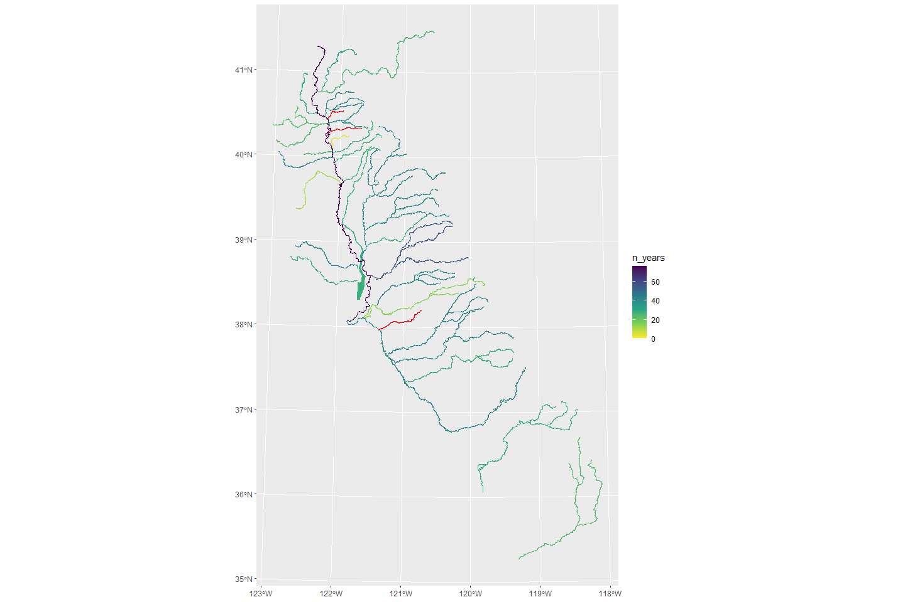

CDEC Overview
================
[Skyler Lewis](mailto:slewis@flowwest.com)
2024-01-17

## CDEC Summary

\[1 sentence description of data type (modeled or gage)…and source and
purpose.\]

- **Source:** California Department of Water Resources (DWR),
  aggregating hydrologic datasets from many sources including counties,
  water districts, CDFW, NPS, USFS, USGS, USACE, and DWR itself.
- **Accessibility:** Public, open and accessible online
- **Coverage:** State of California, where data is available
- **Temporal Coverage:** Max temporal range is 1949-present. The Lower
  Sacramento River has data back to 1949 and the American River back
  to 1970. 38% of reaches have data from 1984 or earlier. 81% of reaches
  have data for 1997 or earlier. 97% of reaches have data from 2015 or
  earlier.
- **Spatial Coverage:** 37 of 40 tested reaches have data available.
  Reach definitions are the 34 SIT reaches (including Yolo Bypass and
  Sutter Bypass) plus the western Delta tributaries (Putah Creek and
  Cache Creek), major Tulare Basin rivers (Kings River and Kern River),
  and major upper Sacramento basin rivers (McCloud River and Pit River).
- **Maintenance:** Each gauge has a maintaining agency which may or may
  not include DWR. CDEC staff will report issues and forward maintenance
  requests to the relevant agency. Level of maintenance likewise varies
  by gauge.
- **Contact:** Data / Model Contact (think about if worth expanding to a
  larger list of people / orgs) - think about having table section below
  with projects/contacts
- **Utilized By:** What process is it used in: (list processes that use
  this data)

## Data Access

### Parameters

#### Stations

Station IDs follow a 3-character alphanumeric format. When the ID is
known, the station metadata can be looked up using the following URL
pattern:

`https://cdec.water.ca.gov/dynamicapp/staMeta?station_id={XXX}`

CDEC has an interactive station locator map located at
<https://cdec.water.ca.gov/webgis/?appid=cdecstation>

Stations can also be queried by river basin, which include the following
options:

``` r
river_basins <- read_csv("cdec_river_basins.csv")
if(interactive()){
  river_basins |> DT::datatable()
} else {
  river_basins |> pull(river_basin) |> paste(collapse=", ") |> cat()
}
```

    ## ALAMEDA CREEK, AMARGOSA RIVER, AMERICAN RIVER, ANTELOPE VALLEY, ARROYO GRANDE CREEK, ARROYO PASAJERO, BATTLE CREEK, BEAR RIVER, BUTTE CREEK, CACHE CREEK, CALAVERAS RIVER, CALIENTE CREEK, CALLEGUAS CREEK, CANTUA CREEK, CARMEL RIVER, CARRIZO CREEK, CARSON RIVER, CHINA LAKE, CHOWCHILLA RIVER, COAST-MARIN, COAST-MORRO BAY, COAST-SAN MATEO, COLORADO RIVER, COSUMNES RIVER, COTTONWOOD CREEK, COYOTE WASH, CUYAMA RIVER, DELTA, EAST BAY, EEL RIVER, FEATHER RIVER, FRESNO RIVER, GARCIA RIVER, GUADALUPE RIVER, GUALALA RIVER, HAT CREEK, JACALITOS CR, KAWEAH RIVER, KELLOGG CREEK, KERN RIVER, KINGS RIVER, KLAMATH RIVER, LAKE TAHOE, LITTLEJOHN CREEK, LOS ANGELES RIVER, LOS GATOS CR (NEAR COALINGA), LOS GATOS CR (NEAR SAN JOSE), LYTLE CREEK, MAD RIVER, MATTOLE RIVER, MC CLOUD RIVER, MERCED RIVER, MOJAVE DESERT, MOJAVE RIVER, MOKELUMNE RIVER, MONO LAKE, MONTEREY COAST, NACIMIENTO RIVER, NAPA RIVER, NAVARRO RIVER, NOYO RIVER, OTAY RIVER, OWENS RIVER, PAJARO RIVER, PETALUMA RIVER, PIRU CREEK, PIT RIVER, PUTAH CREEK, REDWOOD CREEK, RUBICON RIVER, RUSSIAN RIVER, S BARBARA COAST, SACRAMENTO RIVER, SACTO VLY NE, SACTO VLY WEST, SALINAS RIVER, SALMON RIVER, SAN ANTONIO CR (SF BAY), SAN ANTONIO CR (SOUTH COAST), SAN BENITO RIVER, SAN DIEGO RIVER, SAN DIEGUITO RIVER, SAN FRANCISCO BAY, SAN GABRIEL RIVER, SAN GREGORIO CREEK, SAN JACINTO RIVER, SAN JOAQUIN FLOOR, SAN JOAQUIN RIVER, SAN JOAQUIN VLY WEST, SAN LORENZO RIVER, SAN LUIS CREEK, SAN LUIS OBISPO CREEK, SAN LUIS REY RIVER, SAN MATEO CREEK, SANTA ANA AB NARROWS, SANTA ANA RIVER, SANTA CLARA RIVER, SANTA CLARA VALLEY, SANTA CRUZ CO COAST, SANTA MARGARITA RIVER, SANTA MARIA RIVER, SANTA YNEZ RIVER, SCOTT RIVER, SHASTA RIVER, SISQUOC RIVER, SMITH RIVER, SODA CREEK, STANISLAUS RIVER, STEVENS CREEK, STONY CREEK, SURPRISE VALLEY, SUSAN RIVER, SWEETWATER RIVER, TEHACHAPI MOUNTAINS, TRINITY RIVER, TRUCKEE RIVER, TULARE LAKE, TULARE LAKE WESTSIDE, TULE RIVER, TUOLUMNE RIVER, U SANTA CLARA RIVER, ULATIS CREEK, UPPER SALINAS RIVER, VAN DUZEN RIVER, VENTURA LA COASTAL, VENTURA RIVER, WALKER RIVER, WEST SALTON SEA, WHITE RIVER, WHITEWATER RIVER, YUBA RIVER

#### Sensors

Refer to the station ID for which sensors are available at a particular
station.

Following are the sensor codes that report some variation of flow in
cfs. There are many other codes not listed here including stage,
temperature, turbidity, etc.

*Most common sensor codes, mapped in this report:*

- **`20`** = **FLOW** = FLOW, RIVER DISCHARGE, CFS
- **`41`** = **MFLOW** = FLOW, MEAN DAILY, CFS
- **`110`** = **DIVERSN** = FLOW, CANAL DIVERSION, CFS

*Others reporting flow data in CFS:*

- **`76`** = **INFLOW** = RESERVOIR INFLOW, CFS
- **`23`** = **OUTFLOW** = RESERVOIR OUTFLOW, CFS
- **`7`** = **REL SCH** = SCHEDULED RELEASE, CFS (manually reported)
- **`210`** = **AUXFLOW** = FLOW AUX, CFS
- **`165`** = **FLOW.XX** = FLOW, RIVER DISCHARGE PRECISE, CFS (rarely
  used)
- **`8`** = **FNF** = FULL NATURAL FLOW, CFS (modeled)

#### Durations (timesteps)

A particular station sensor will have data available at one or more of
these duration types. The station lookup page will describe which
sensor-duration combinations are available.

- **`E`** = **EVENT** (typically 15-minute intervals)
- **`H`** = **HOURLY**
- **`D`** = **DAILY**

For example,
[BCK](https://cdec.water.ca.gov/dynamicapp/staMeta?station_id=BCK) has
flow data (sensor `20`) available at the 15-minute (duration `E`) and
hourly (duration `H`) timesteps, as well as in a summarized daily mean
format (sensor `41`, duration `D`).

### Data Access Options

#### CSV web service

Data can be queried in CSV format using the following URL template,
including the 3-digit station ID, the sensor and duration codes
described above, and the start and end dates.

`https://cdec.water.ca.gov/dynamicapp/req/CSVDataServlet?Stations={XXX}&SensorNums={XX}&dur_code={X}&Start={YYYY-MM-DD}&End={YYYY-MM-DD}`

#### Web API

Data can be queried via the CDEC API. This is documented in PDFs linked
at <https://cdec.water.ca.gov/queryTools.html>

#### Visual Interface

Real-time, daily, monthly query options are available at the following
link: <https://cdec.water.ca.gov/queryTools.html>

An alternate interface allows the user to query the most recent data by
each sensor, listed out for an entire river basin:
<https://cdec.water.ca.gov/dynamicapp/getAll>

#### R package `CDECRetrieve`

FlowWest developed the R package `CDECRetrieve` for querying CDEC data.
This package is documented at <https://github.com/FlowWest/CDECRetrieve>
and can be installed via:

``` r
remotes::install_github("flowwest/CDECRetrieve")
```

## Spatial & Temporal Coverage

The following section assesses spatial and temporal coverage. Still need
to assess presence of `NA`s within the start and end time windows.

``` r
cdec_station_sensor_list_filename <- "cdec_station_sensor_list.Rds"

if(!file.exists(cdec_station_sensor_list_filename)){
  
  cdec_station_sensor_list <- 
    river_basins |>
      filter(selected) |>
      mutate(stations = map(river_basin, possibly(function(x) {
        CDECRetrieve::cdec_stations(river_basin = x) |> 
          select(-river_basin, -elevation) # dropping elev, CDECRetrieve issue
        }, otherwise = NA))) |> 
      unnest(stations) |>
      mutate(datasets = map(station_id, possibly(function(x) {
        CDECRetrieve::cdec_datasets(station = x)
        }, otherwise = NA))) |>
      unnest(datasets)
  
  cdec_station_sensor_list |> saveRDS(cdec_station_sensor_list_filename)
  
} else {
  
  cdec_station_sensor_list <- readRDS(cdec_station_sensor_list_filename)
  
}
```

``` r
selected_sensors <- c(20, 41, 110)

cdec_station_sensors <- 
  cdec_station_sensor_list |> 
  mutate(min_wy = year(start %m+% months(3)),
         max_wy = year(end %m+% months(3))) |>
  filter(sensor_number %in% selected_sensors) |>
  st_as_sf(coords = c("longitude", "latitude"), crs="EPSG:4269") |>
  st_transform("EPSG:3310")

cdec_stations <- cdec_station_sensors |>
  group_by(station_id, name, county, operator) |> # also summarize list of sensors included
  summarize(sensors = list(unique(sensor_number))) |>
  st_union(by_feature = TRUE) 
```

    ## `summarise()` has grouped output by 'station_id', 'name', 'county'. You can
    ## override using the `.groups` argument.

``` r
#cdec_stations |> st_write("out/cdec_stations.shp", append=FALSE)
```

``` r
manual_station_list <- 
  read_csv("cdec_mainstem_stations.csv") |>
  janitor::clean_names() |>
  filter(!is.na(channel) & channel != "???") |>
  mutate(station_id = str_to_lower(station_id),
         mainstem = TRUE)
```

    ## Rows: 235 Columns: 5
    ## ── Column specification ────────────────────────────────────────────────────────
    ## Delimiter: ","
    ## chr (5): Section, Channel, Station ID, Station Name, Notes
    ## 
    ## ℹ Use `spec()` to retrieve the full column specification for this data.
    ## ℹ Specify the column types or set `show_col_types = FALSE` to quiet this message.

``` r
cdec_stations <- cdec_stations |>
  left_join(manual_station_list, join_by(station_id == station_id)) |>
  mutate(mainstem = coalesce(mainstem, FALSE))

cdec_station_sensors <- cdec_station_sensors |>
  left_join(manual_station_list, join_by(station_id == station_id)) |>
  mutate(mainstem = coalesce(mainstem, FALSE))
```

### Temporal Coverage

Not shown:

Version with only verified mainstem data

``` r
check_for_overlap <- function(wy, chan, sec) {
  cdec_station_sensors |>
    filter(channel == chan & section == sec) |>
    mutate(in_range = (wy >= min_wy) & (wy <= max_wy)) |>
    pull(in_range) |>
    any()
}

data_avail_by_water_year <- 
  expand_grid(water_year = seq(1949,2024,1), 
              manual_station_list |> select(channel, section) |> unique()) |>
  mutate(has_data = pmap_lgl(list(water_year, channel, section), check_for_overlap))

data_avail_by_water_year |>
  filter(!is.na(channel)) |>
  ggplot() + 
  facet_grid(rows = vars(channel), scales="free_y", space="free_y") +
  geom_tile(aes(x = factor(water_year), y = factor(section), fill = has_data)) +
  xlab("Water Year") + 
  ylab("") + 
  theme_minimal() + 
  theme(legend.position = "top", 
        axis.text.x = element_text(angle = 90, vjust = 0.5, hjust=1), 
        strip.text = element_blank(),
        panel.margin=unit(0,"lines")) + 
  scale_y_discrete(limits=rev, position="right") +
  scale_fill_manual(values = c("FALSE" = "white", "TRUE" = "darkgray"))
```

<!-- --> Not listed:
Bear Creek, Paynes Creek, Calaveras River

``` r
station_table <- 
  cdec_station_sensors |>
  filter(mainstem) |>
  group_by(channel, section, station_id, station_name) |>
  summarize(start_date = min(start),
            end_date = min(end),
            sensors = list(unique(sensor_number)),
            ) |>
  mutate(freq_avail = paste(map(sensors, function(x) if_else(20 %in% x, "hourly", "daily")))) |>
  select(channel, section, station_id, station_name, start_date, end_date, freq_avail)
```

    ## `summarise()` has grouped output by 'channel', 'section', 'station_id'. You can
    ## override using the `.groups` argument.

``` r
station_table |> write_csv("out/station_table.csv")
```

### Spatial Coverage

``` r
# import a few different watershed files
# use intersection with these polys to detect if in the basin
watersheds_huc8 <- 
  st_read("shp/calw221_huc_8_selected.shp", as_tibble=TRUE) |>
  janitor::clean_names() |>
  st_transform("EPSG:3310") |>
  select(huc_8, huc_8_name, wshed_id)
```

    ## Reading layer `calw221_huc_8_selected' from data source 
    ##   `C:\Users\skylerlewis\Github\mwd-interoperable-flows\data-raw\shp\calw221_huc_8_selected.shp' 
    ##   using driver `ESRI Shapefile'
    ## Simple feature collection with 60 features and 5 fields
    ## Geometry type: POLYGON
    ## Dimension:     XY
    ## Bounding box:  xmin: -267648.5 ymin: -359620.2 xmax: 182116.2 ymax: 423148.3
    ## Projected CRS: NAD83 / California Albers

``` r
subwatersheds_huc12 <- 
  st_read("shp/wbd_subwatershed_selected.shp", as_tibble=TRUE) |>
  janitor::clean_names() |>
  st_transform("EPSG:3310")
```

    ## Reading layer `wbd_subwatershed_selected' from data source 
    ##   `C:\Users\skylerlewis\Github\mwd-interoperable-flows\data-raw\shp\wbd_subwatershed_selected.shp' 
    ##   using driver `ESRI Shapefile'
    ## Simple feature collection with 1737 features and 21 fields
    ## Geometry type: POLYGON
    ## Dimension:     XY
    ## Bounding box:  xmin: -123.0976 ymin: 34.77517 xmax: -117.9808 ymax: 41.82645
    ## Geodetic CRS:  NAD83

``` r
subwatersheds_calw221 <-
  st_read("shp/calw221_selected.shp", as_tibble=TRUE) |>
  janitor::clean_names() |>
  st_transform("EPSG:3310")
```

    ## Reading layer `calw221_selected' from data source 
    ##   `C:\Users\skylerlewis\Github\mwd-interoperable-flows\data-raw\shp\calw221_selected.shp' 
    ##   using driver `ESRI Shapefile'
    ## Simple feature collection with 3005 features and 38 fields
    ## Geometry type: POLYGON
    ## Dimension:     XY
    ## Bounding box:  xmin: -267648.5 ymin: -359620.2 xmax: 182116.2 ymax: 423148.3
    ## Projected CRS: NAD83 / California Albers

``` r
watershed_labels <- 
  st_read("shp/wbd_huc10_group_by_river_name.shp", as_tibble=TRUE) |>
  janitor::clean_names() |>
  st_transform("EPSG:3310") |>
  rename(river_basin = river_name)
```

    ## Reading layer `wbd_huc10_group_by_river_name' from data source 
    ##   `C:\Users\skylerlewis\Github\mwd-interoperable-flows\data-raw\shp\wbd_huc10_group_by_river_name.shp' 
    ##   using driver `ESRI Shapefile'
    ## Simple feature collection with 40 features and 1 field
    ## Geometry type: POLYGON
    ## Dimension:     XY
    ## Bounding box:  xmin: -123.0976 ymin: 34.77517 xmax: -117.9808 ymax: 41.82645
    ## Geodetic CRS:  NAD83

``` r
# import river and creek stream lines
# use intersection with buffered flowline shapefile to detect if on the mainstem
stream_flowlines <- 
  st_read("shp/ca_streams_selected.shp", as_tibble=TRUE) |>
  janitor::clean_names() |>
  st_zm() |>
  st_transform("EPSG:3310") |>
  mutate(label = coalesce(name, paste0("Tributary of ",down_name)))
```

    ## Reading layer `ca_streams_selected' from data source 
    ##   `C:\Users\skylerlewis\Github\mwd-interoperable-flows\data-raw\shp\ca_streams_selected.shp' 
    ##   using driver `ESRI Shapefile'
    ## Simple feature collection with 87 features and 20 fields
    ## Geometry type: LINESTRING
    ## Dimension:     XYM
    ## Bounding box:  xmin: -257718.9 ymin: -305264.9 xmax: 171875.1 ymax: 386351.3
    ## m_range:       mmin: 0 mmax: 597993.6
    ## Projected CRS: NAD83 / California Albers

``` r
bypass_polys <- 
  st_read("shp/yolo_sutter_bypass_extents.shp", as_tibble=TRUE) |>
  janitor::clean_names() |>
  st_transform("EPSG:3310") |>
  mutate(name = map(area_name, function(x) str_split_1(x, " - ")[1])) |> 
  unnest() |>
  group_by(name) |>
  summarize() |>
  st_union(by_feature = TRUE)
```

    ## Reading layer `yolo_sutter_bypass_extents' from data source 
    ##   `C:\Users\skylerlewis\Github\mwd-interoperable-flows\data-raw\shp\yolo_sutter_bypass_extents.shp' 
    ##   using driver `ESRI Shapefile'
    ## Simple feature collection with 8 features and 7 fields
    ## Geometry type: POLYGON
    ## Dimension:     XY
    ## Bounding box:  xmin: 6554790 ymin: 1876136 xmax: 6688689 ymax: 2368307
    ## Projected CRS: NAD83(2011) / California zone 2 (ftUS)

#### Geographic distribution of sensors

``` r
if (interactive()) {
  leaflet::leaflet() |> 
  leaflet::addTiles() |> 
  leaflet::addPolygons(data=st_transform(watershed_labels, "EPSG:4326"), label=~river_basin, color="gray") |>
  leaflet::addPolygons(data=st_transform(bypass_polys, "EPSG:4326"), label=~name, fillColor="darkblue", opacity=0.5, color=NA) |>
  leaflet::addPolylines(data=st_transform(stream_flowlines, "EPSG:4326"), label=~label, color="darkblue") |>
  leaflet::addCircleMarkers(data=st_transform(cdec_stations, "EPSG:4326"), 
                            label=~paste(station_id, name, operator, paste(sensors), sep="<br>") |> lapply(htmltools::HTML),
                            color = ~if_else(mainstem, "darkred", "darkgray")) 
} else {
 ggplot() + 
    geom_sf(data=watershed_labels, color="gray") + 
    geom_sf(data=bypass_polys, fill="darkblue", color=NA, alpha=0.5) +
    geom_sf(data=stream_flowlines, color="darkblue") + 
    geom_sf(data=cdec_stations, aes(color=mainstem)) +
    scale_color_manual(values = c("TRUE" = "darkred", "FALSE" = "darkgray"))
}
```

<!-- -->

#### Years of data available by stream

``` r
first_year_available <- data_avail_by_water_year |>
  filter(has_data) |>
  group_by(channel, water_year) |>
  summarize(has_data = any(has_data)) |>
  group_by(channel) |>
  summarize(first_year = min(water_year),
            n_years = n())
```

    ## `summarise()` has grouped output by 'channel'. You can override using the
    ## `.groups` argument.

``` r
river_names <- watershed_labels$river_basin |> unique() |> c("Yolo Bypass", "Sutter Bypass")
match_name <- function(x) paste0(river_names[which(str_detect(x, river_names))][1],"")
flowlines_first_year_available <- 
  stream_flowlines |>
  mutate(
    river_name = coalesce(name, down_name),
    matched = map_lgl(river_name, function(x) any(str_detect(x, river_names))),
    river_name = if_else(matched, map_chr(river_name, match_name), NA)) |>
  filter(!is.na(river_name)) |>
  group_by(river_name) |>
  summarize() |>
  st_union(by_feature = TRUE) |>
  left_join(first_year_available, by = join_by(river_name == channel)) |>
  mutate(n_years = coalesce(n_years, 0)) 

bypasses_first_year_available <- 
  bypass_polys |>
  filter(name %in% c("Yolo Bypass", "Sutter Bypass")) |>
  left_join(first_year_available, by = join_by(name == channel)) |>
  mutate(n_years = coalesce(n_years, 0)) 

ggplot() +
  geom_sf(data = bypasses_first_year_available, aes(fill = n_years), color=NA) + 
  geom_sf(data = bypasses_first_year_available |> filter(n_years==0), fill="red", color=NA) +
  geom_sf(data = flowlines_first_year_available, aes(color = n_years)) + 
  geom_sf(data = flowlines_first_year_available |> filter(n_years==0), color="red") +
  scale_color_viridis_c(direction=-1, aesthetics = c("color", "fill"))
```

<!-- -->

``` r
first_year_available_by_section <- data_avail_by_water_year |>
  filter(has_data) |>
  group_by(channel, section, water_year) |>
  summarize(has_data = any(has_data)) |>
  group_by(channel, section) |>
  summarize(first_year = min(water_year),
            n_years = n())
```

    ## `summarise()` has grouped output by 'channel', 'section'. You can override
    ## using the `.groups` argument.
    ## `summarise()` has grouped output by 'channel'. You can override using the
    ## `.groups` argument.

``` r
tibble(yr = c(1949, 1984, 1997, 2015)) |>
  mutate(percent_of_data = map(yr, function(x) mean(coalesce(first_year_available_by_section$first_year,0)<=x))) |>
  unnest() *100
```

    ##       yr percent_of_data
    ## 1 194900        2.702703
    ## 2 198400       37.837838
    ## 3 199700       81.081081
    ## 4 201500       97.297297

## Quality Checks

**What quality assurance checks are implemented by monitoring agency?**

(expand here)

**What quality control checks are implemented by monitoring agency?**

(expand here)

### Error codes

Flow data include the following error codes when downloaded direct from
CDEC using the CSV servlet.

- **`-9998`** = Below Rating Table\*
- **`-9997`** = Above Rating Table\*
- **`m`** = missing value

\*According to the CDEC FAQ: “River flow data for stations with river
stage data are computed using a specific rating table/rating curve for
each particular station. When the river stage is above or below the
available rating table, a flow cannot be computed.”

## Data use and limitations

| Use Case                       | Benefits | Limitations |
|--------------------------------|----------|-------------|
| Continuous empirical flow data | …        | …           |
| …                              | …        | …           |

## Questions for Data Experts

- Please list any questions about the data source.
