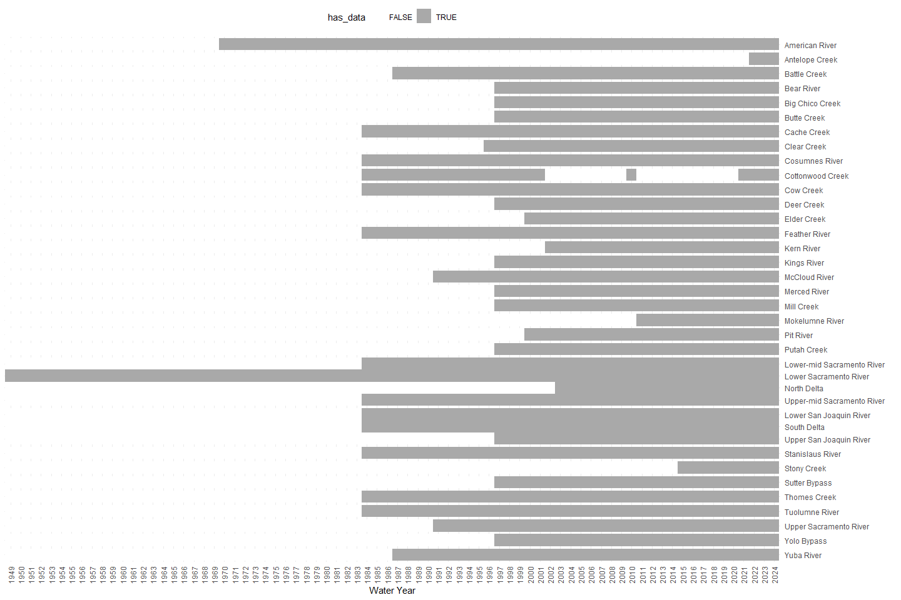
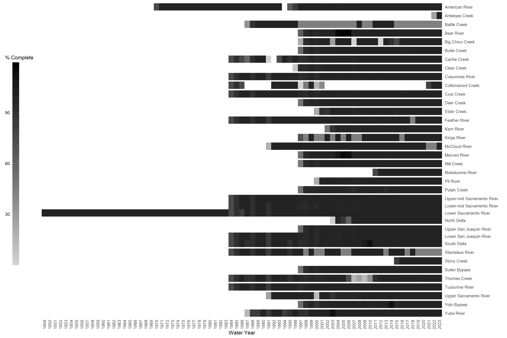
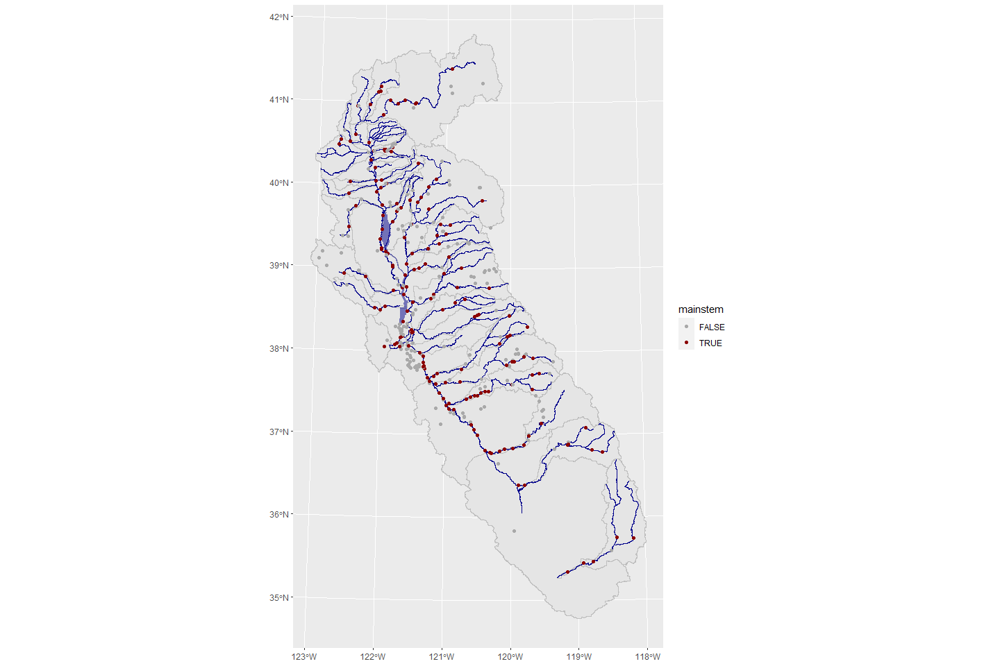
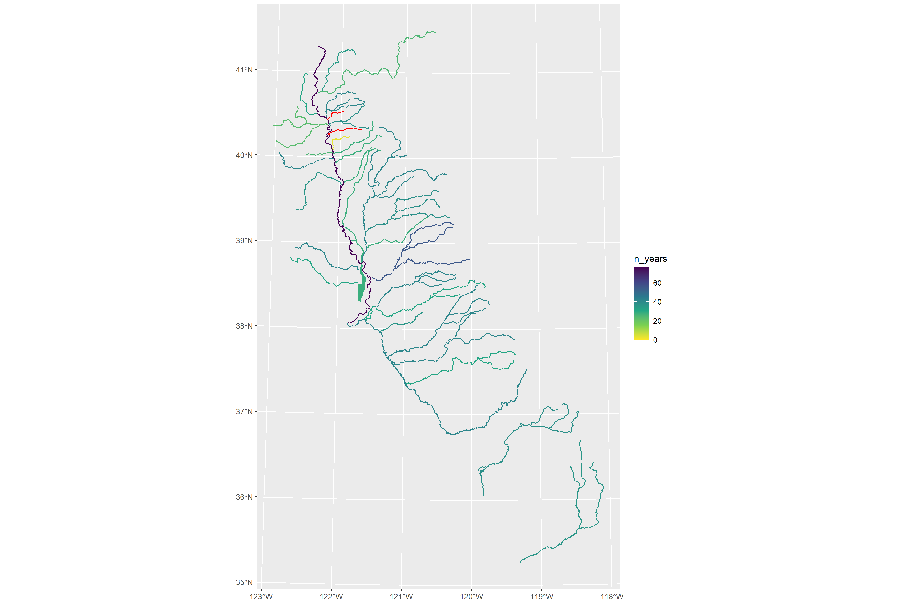

CDEC Overview
================
[Skyler Lewis](mailto:slewis@flowwest.com)
2024-02-14

## CDEC Summary

\[1 sentence description of data type (modeled or gage)…and source and
purpose.\]

- **Source:** California Department of Water Resources (DWR),
  aggregating hydrologic datasets from many sources including counties,
  water districts, CDFW, NPS, USFS, USGS, USACE, and DWR itself.
- **Accessibility:** Public, open and accessible online
- **Coverage:** State of California, where data is available
- **Temporal Coverage:** Max temporal range is 1949-present. The Lower
  Sacramento River has data back to 1949 and the American River back
  to 1970. 35% of reaches have data from 1984 or earlier. 75% of reaches
  have data for 1997 or earlier. 90% of reaches have data from 2015 or
  earlier.
- **Spatial Coverage:** 37 of 40 tested reaches have data available.
  Reach definitions are the 34 SIT reaches (including Yolo Bypass and
  Sutter Bypass) plus the western Delta tributaries (Putah Creek and
  Cache Creek), major Tulare Basin rivers (Kings River and Kern River),
  and major upper Sacramento basin rivers (McCloud River and Pit River).
- **Maintenance:** Each gauge has a maintaining agency which may or may
  not include DWR. CDEC staff will report issues and forward maintenance
  requests to the relevant agency. Level of maintenance likewise varies
  by gauge.
- **Contact:** General CDEC contact:(916) 574-1777 / [DWR contact
  form](https://water.ca.gov/Contact); specific gage data contacts
  depend on which organization/agency is responsible for maintaining the
  gage.
- **Utilized By:** What process is it used in: (list processes that use
  this data)

## Data Access

### Parameters

#### Stations

Station IDs follow a 3-character alphanumeric format. When the ID is
known, the station metadata can be looked up using the following URL
pattern:

`https://cdec.water.ca.gov/dynamicapp/staMeta?station_id={XXX}`

CDEC has an station locator map located at
<https://cdec.water.ca.gov/webgis/?appid=cdecstation>

Stations can also be queried by river basin. For the greater
Sacramento-San Joaquin basin, this includes the following river basins:

``` r
river_basins <- read_csv("cdec_river_basins.csv")
river_basins |> filter(selected) |> pull(river_basin) |> paste(collapse=", ") |> cat()
```

    ## AMERICAN RIVER, BATTLE CREEK, BEAR RIVER, BUTTE CREEK, CACHE CREEK, CALAVERAS RIVER, COSUMNES RIVER, COTTONWOOD CREEK, DELTA, FEATHER RIVER, KERN RIVER, KINGS RIVER, MC CLOUD RIVER, MERCED RIVER, MOKELUMNE RIVER, PIT RIVER, PUTAH CREEK, SACRAMENTO RIVER, SACTO VLY NE, SACTO VLY WEST, SAN JOAQUIN FLOOR, SAN JOAQUIN RIVER, SAN JOAQUIN VLY WEST, STANISLAUS RIVER, STONY CREEK, TUOLUMNE RIVER, YUBA RIVER

#### Sensors

Refer to the station ID for which sensors are available at a particular
station.

Following are the sensor codes that report some variation of flow in
cfs. There are many other codes not listed here including stage,
temperature, turbidity, etc.

*Codes for standard in-stream flow, mapped and summarized in this report
for mainstems:*

- **`20`** = **FLOW** = FLOW, RIVER DISCHARGE, CFS\*
- **`41`** = **MFLOW** = FLOW, MEAN DAILY, CFS\*

*Codes for other flow (cfs) sensors in the CDEC database:*

- **`110`** = **DIVERSN** = FLOW, CANAL DIVERSION, CFS\*
- **`23`** = **OUTFLOW** = RESERVOIR OUTFLOW, CFS\*
- **`76`** = **INFLOW** = RESERVOIR INFLOW, CFS
- **`7`** = **REL SCH** = SCHEDULED RELEASE, CFS (manually reported)
- **`210`** = **AUXFLOW** = FLOW AUX, CFS
- **`165`** = **FLOW.XX** = FLOW, RIVER DISCHARGE PRECISE, CFS (rarely
  used)
- **`8`** = **FNF** = FULL NATURAL FLOW, CFS (modeled)

\*sensors indicated are also shown on the map for context but are not
included in the summary stats for this report

#### Durations (timesteps)

A particular station sensor will have data available at one or more of
these duration types. The station lookup page will describe which
sensor-duration combinations are available.

- **`E`** = **EVENT** (typically 15-minute intervals)
- **`H`** = **HOURLY**
- **`D`** = **DAILY**

For example,
[BCK](https://cdec.water.ca.gov/dynamicapp/staMeta?station_id=BCK) has
flow data (sensor `20`) available at the 15-minute (duration `E`) and
hourly (duration `H`) timesteps, as well as in a summarized daily mean
format (sensor `41`, duration `D`).

### Data Access Options

#### CSV web service

Data can be queried in CSV format using the following URL template,
including the 3-digit station ID, the sensor and duration codes
described above, and the start and end dates.

`https://cdec.water.ca.gov/dynamicapp/req/CSVDataServlet?Stations={XXX}&SensorNums={XX}&dur_code={X}&Start={YYYY-MM-DD}&End={YYYY-MM-DD}`

#### Web API

Data can be queried via the CDEC API. This is documented in PDFs linked
at <https://cdec.water.ca.gov/queryTools.html>

#### Visual Interface

Real-time, daily, monthly query options are available at the following
link: <https://cdec.water.ca.gov/queryTools.html>

An alternate interface allows the user to query the most recent data by
each sensor, listed out for an entire river basin:
<https://cdec.water.ca.gov/dynamicapp/getAll>

#### R package `CDECRetrieve`

FlowWest developed the R package `CDECRetrieve` for querying CDEC data.
This package is documented at <https://github.com/FlowWest/CDECRetrieve>
and can be installed via:

``` r
remotes::install_github("flowwest/CDECRetrieve")
```

## Spatial & Temporal Coverage

The following section assesses spatial and temporal coverage of the
stations.

### Temporal Coverage

#### Sensor date ranges

The following chart summarizes the ranges of data availability. This is
based on the published start and end dates and does not account for NA
values within these ranges. Not listed in this figure because no
stations are present: *Bear Creek, Paynes Creek, Calaveras River*.

``` r
check_for_overlap <- function(wy, chan, sec) {
  cdec_station_sensors |>
    filter(channel == chan & section == sec) |>
    mutate(in_range = (wy >= min_wy) & (wy <= max_wy)) |>
    pull(in_range) |>
    any()
}

data_avail_by_water_year <- 
  expand_grid(water_year = seq(1949,2024,1), 
              manual_station_list |> select(channel, section) |> unique()) |>
  mutate(has_data = pmap_lgl(list(water_year, channel, section), check_for_overlap))

first_year_available <- 
  data_avail_by_water_year |>
  filter(has_data) |>
  group_by(channel, water_year) |>
  summarize(has_data = any(has_data)) |>
  group_by(channel) |>
  summarize(first_year = min(water_year),
            n_years = n())

data_avail_by_water_year |>
  filter(!is.na(channel)) |>
  ggplot() + 
  facet_grid(rows = vars(channel), scales="free_y", space="free_y") +
  geom_tile(aes(x = factor(water_year), y = factor(section), fill = has_data)) +
  xlab("Water Year") + 
  ylab("") + 
  theme_minimal() + 
  theme(legend.position = "top", 
        axis.text.x = element_text(angle = 90, vjust = 0.5, hjust=1), 
        strip.text = element_blank(),
        panel.margin=unit(0,"lines")) + 
  scale_y_discrete(limits=rev, position="right") +
  scale_fill_manual(values = c("FALSE" = "white", "TRUE" = "darkgray"))
```

<!-- -->

#### Percent non-missing

The following table and chart summarize the percentage of non-missing
observations, within each water year, by station and by channel/section.

``` r
retrieve_cdec_csv <- function(sta=character(), sen=character(), dur=character(), 
                     start_date=ymd("1900-10-01"), end_date=ymd("2023-09-30"),
                     dir="temp") {
  name <- str_to_upper(paste0(sta, "_", sen, "_", dur))
  filename <- file.path(dir, paste0(name,".csv.gz"))
  if(!file.exists(filename)){
    message(paste0("downloading to ",filename))
    dir.create(dir, recursive = TRUE)
    data_raw <-
      httr::GET(
      url="https://cdec.water.ca.gov/dynamicapp/req/CSVDataServlet",
      query=list(Stations=sta, SensorNums=sen, dur_code=dur, 
                 Start=format(start_date,"%Y-%m-%d"), End=format(end_date,"%Y-%m-%d"))) |> 
      httr::content("raw") 
    gzf <- gzcon(file(filename, "wb"))
    data_raw |> writeBin(gzf)
    close(gzf)
  } else {
    message(paste0(filename, " exists, loading"))
  }
  return(filename)
}

count_obs_by_wy <- function(filename) {
  read_csv(filename, 
         col_select = c(date_time = "DATE TIME", value = "VALUE"),
         col_types = list(col_datetime(), col_double())) |>
    janitor::clean_names() |>
    mutate(water_year = if_else(month(date_time)>=10, year(date_time)+1, year(date_time))) |>
    group_by(water_year) |> 
    summarize(obs=n(),
              err_brt=sum(value==-9998),
              err_art=sum(value==-9997),
              err_mis=sum(is.na(value)),) |>
    as.list()
}

if(!file.exists("cdec_obs_counts.Rds")) {
  
  obs_counts <- cdec_station_sensors |>
    st_drop_geometry() |>
    filter(!is.na(section)) |>
    #head(5) |>
    mutate(result = pmap(list(station_id, 
                              sensor_number, 
                              case_when(duration=="event"~"E",
                                        duration=="hourly"~"H",
                                        duration=="daily"~"D",
                                        duration=="monthly"~"M"),
                              start, end),
      function(sta,sen,dur,start,end) count_obs_by_wy(retrieve_cdec_csv(sta,sen,dur,start,end)))) |>
    unnest_wider(result) |> unnest(c(water_year, obs, err_brt, err_art, err_mis)) |>
    mutate(n_days = if_else(water_year%%4==0,366,365),
           hyp_obs = case_when(duration=="event" ~ n_days*24*4,
                               duration=="hourly" ~ n_days*24,
                               duration=="daily" ~ n_days,
                               duration=="monthly" ~ 12),
           pct_complete = (obs - (err_brt + err_art + err_mis)) / hyp_obs)
  
  obs_counts |> saveRDS("cdec_obs_counts.Rds")
  
} else {
  
  obs_counts <- readRDS("cdec_obs_counts.Rds")
  
}

if(interactive() | coalesce(knitr::pandoc_to(),"")=="html"){
  manual_station_list |>
    select(channel, section, station_id, station_name) |>
    left_join(select(obs_counts, station_id, water_year, pct_complete)) |>
    mutate(pct_complete=round(pct_complete*100,1)) |>
    DT::datatable(filter = list(position = 'top', clear = FALSE),
                  options = list(pageLength = 5))
} else {
  manual_station_list |>
    select(channel, section, station_id, station_name) |>
    left_join(select(obs_counts, station_id, water_year, pct_complete)) |>
    mutate(pct_complete=num(pct_complete, label = "%", scale=100)) |>
    head(10) |> knitr::kable()
}
```

| channel   | section   | station_id | station_name         | water_year | pct_complete |
|:----------|:----------|:-----------|:---------------------|-----------:|-------------:|
| Pit River | Pit River | pcn        | Pit River near Canby |       2000 |         20.6 |
| Pit River | Pit River | pcn        | Pit River near Canby |       2001 |         99.7 |
| Pit River | Pit River | pcn        | Pit River near Canby |       2002 |        100\. |
| Pit River | Pit River | pcn        | Pit River near Canby |       2003 |         99.9 |
| Pit River | Pit River | pcn        | Pit River near Canby |       2004 |         99.7 |
| Pit River | Pit River | pcn        | Pit River near Canby |       2005 |         93.4 |
| Pit River | Pit River | pcn        | Pit River near Canby |       2006 |         99.4 |
| Pit River | Pit River | pcn        | Pit River near Canby |       2007 |         97.4 |
| Pit River | Pit River | pcn        | Pit River near Canby |       2008 |         98.8 |
| Pit River | Pit River | pcn        | Pit River near Canby |       2009 |         99.5 |

``` r
obs_counts_summary <- 
  obs_counts |> 
  group_by(station_id, water_year) |>
  mutate(best_duration = case_when(any(duration=="event")~"event",
                                   any(duration=="hourly")~"hourly",
                                   any(duration=="daily")~"daily",
                                   any(duration=="monthly")~"monthly")) |>
  filter(duration == best_duration) |>
  ungroup() |>
  filter(water_year <= 2023)

overall_pct_complete_by_station <-
  obs_counts_summary |>
  group_by(channel, section, station_id) |>
  summarize(pct_complete = coalesce(mean(pct_complete),0))

overall_pct_complete_by_section <-
  overall_pct_complete_by_station |>
  group_by(channel, section) |>
  summarize(pct_complete = coalesce(max(pct_complete),0))

obs_counts_summary |>
  group_by(channel, section, water_year) |>
  summarize(pct_complete = max(pct_complete)) |>
  ggplot() + 
  facet_grid(rows = vars(channel), scales="free_y", space="free_y") +
  geom_tile(aes(x = factor(water_year), y = factor(section), fill = pct_complete*100)) +
  xlab("Water Year") + 
  ylab("") + 
  theme_minimal() + 
  theme(legend.position = "left", 
        axis.text.x = element_text(angle = 90, vjust = 0.5, hjust=1), 
        strip.text = element_blank(),
        panel.margin=unit(0,"lines"),
        panel.grid = element_blank(),
        ) + 
  scale_y_discrete(limits=rev, position="right") +
  scale_fill_gradient(low="lightgray", high = "black") + 
  guides(fill=guide_colorbar(barwidth=1, barheight=30, label.position = "left", title = "% Complete"))
```

<!-- -->

#### Summary

``` r
station_table <- 
  cdec_station_sensors |>
  filter(mainstem) |>
  group_by(channel, section, station_id, station_name) |>
  summarize(start_date = min(start),
            end_date = min(end),
            sensors = list(unique(sensor_number)),
            ) |>
  mutate(freq_avail = paste(map(sensors, function(x) if_else(20 %in% x, "hourly", "daily")))) |>
  select(channel, section, station_id, station_name, start_date, end_date, freq_avail) |>
  left_join(overall_pct_complete_by_station) |>
  mutate(pct_complete = coalesce(pct_complete,0))

station_table |> write_csv("out/station_table.csv")

if(interactive() | coalesce(knitr::pandoc_to(),"")=="html"){
  station_table |> st_drop_geometry() |> 
    mutate(pct_complete=round(pct_complete*100,1)) |>
    DT::datatable(filter = list(position = 'top', clear = FALSE),
                  options = list(pageLength = 5))
} else {
  station_table |> st_drop_geometry() |> 
    mutate(pct_complete=num(pct_complete, label = "%", scale=100)) |>
    head(10) |> knitr::kable()
}
```

| channel        | section        | station_id | station_name                                     | start_date | end_date   | freq_avail | pct_complete |
|:---------------|:---------------|:-----------|:-------------------------------------------------|:-----------|:-----------|:-----------|-------------:|
| American River | American River | afo        | American River at Fair Oaks                      | 1998-11-02 | 2024-02-14 | hourly     |         98.3 |
| American River | American River | amf        | American River at Folsom                         | 1995-02-01 | 2001-05-08 | daily      |         87.2 |
| American River | American River | amk        | South Fork American River near Kyburz            | 2012-10-23 | 2024-02-14 | hourly     |         99.4 |
| American River | American River | cbr        | South Fork American River at Chili Bar           | 1997-09-10 | 2024-02-14 | hourly     |         96.4 |
| American River | American River | fol        | Folsom Lake                                      | 1987-01-05 | 2024-02-14 | daily      |         96.1 |
| American River | American River | nfd        | North Fork American River at North Fork Dam      | 1970-01-01 | 2005-11-30 | hourly     |         95.9 |
| American River | American River | oxb        | Middle Fork American River near Oxbow Powerhouse | 1997-10-21 | 2024-02-14 | hourly     |         97.5 |
| Antelope Creek | Antelope Creek | atc        | Antelope Creek near Red Bluff                    | 2022-06-28 | 2024-02-14 | hourly     |         62.9 |
| Battle Creek   | Battle Creek   | bas        | South Fork Battle Creek near Manton              | 2000-07-19 | 2024-02-14 | hourly     |         70.6 |
| Battle Creek   | Battle Creek   | bat        | Battle Creek                                     | 1986-10-01 | 2024-02-14 | hourly     |            0 |

### Spatial Coverage

#### Geographic distribution of sensors

Also shown on this map for context are in-stream flow sensors on
tributaries and secondary channels, as well as canal diversions and
reservoir outflow gages. **(View HTML version for interactive Leaflet
map)**

``` r
if(interactive() | coalesce(knitr::pandoc_to(),"")=="html"){
  watersheds_wgs84 <- st_transform(watershed_labels, "EPSG:4326")
  flowlines_wgs84 <- st_transform(stream_flowlines, "EPSG:4326")
  stations_wgs84 <- st_transform(cdec_stations, "EPSG:4326")
  bypasses_wgs84 <- st_transform(filter(bypass_polys,name %in% c("Sutter Bypass", "Yolo Bypass")), "EPSG:4326")

  leaflet::leaflet() |> 
  leaflet::addTiles(urlTemplate = 'https://server.arcgisonline.com/ArcGIS/rest/services/Ocean/World_Ocean_Base/MapServer/tile/{z}/{y}/{x}',
                 attribution = 'Basemap tiles &copy; Esri &mdash; Sources: GEBCO, NOAA, CHS, OSU, UNH, CSUMB, National Geographic, DeLorme, NAVTEQ, and Esri',
                 options = leaflet::tileOptions(noWrap = TRUE, opacity = 1.0, maxNativeZoom = 13, maxZoom = 13)) |>
  leaflet::addTiles(urlTemplate = 'https://server.arcgisonline.com/ArcGIS/rest/services/Reference/World_Reference_Overlay/MapServer/tile/{z}/{y}/{x}',
                 attribution = 'Reference tiles &copy; Esri &mdash; Source: USGS, Esri, TANA, DeLorme, and NPS',
                 options = leaflet::tileOptions(noWrap = TRUE, opacity = 0.5, maxNativeZoom = 13, maxZoom = 13)) |>  
  leaflet::addPolygons(data=watersheds_wgs84, label=~paste(river_basin, "watershed"), color="#888888", weight=1, fillOpacity = 0.0) |>
  leaflet::addPolygons(data=bypasses_wgs84, label=~name, weight=0, fillColor="#2F88A6", fillOpacity=0.5, color=NA) |>
  leaflet::addPolylines(data=flowlines_wgs84, label=~label, color="#2F88A6") |>
  leaflet::addCircleMarkers(data=stations_wgs84 |> 
                              left_join(st_drop_geometry(station_table)), 
                            label=~paste(str_to_upper(station_id), 
                                         name, 
                                         operator, 
                                         paste(sensors), 
                                         if_else(!is.na(pct_complete),paste(
                                           paste(start_date,"-",end_date),
                                           paste0(round(pct_complete*100),"% complete"),
                                           sep="<br>"),""),
                                         sep="<br>") |> lapply(htmltools::HTML),
                            color = ~if_else(mainstem, "#A6011F", "#888888")) 
} else {
 ggplot() + 
    geom_sf(data=watershed_labels, color="#888888") + 
    geom_sf(data=filter(bypass_polys,name %in% c("Sutter Bypass", "Yolo Bypass")), fill="#2F88A6", color=NA, alpha=0.5) +
    geom_sf(data=stream_flowlines, color="#2F88A6") + 
    geom_sf(data=cdec_stations, aes(color=mainstem)) +
    scale_color_manual(values = c("TRUE" = "#A6011F", "FALSE" = "#888888"))
}
```



#### Years of data available by stream

The following map illustrates the data availability length by stream.
This is based on the published start and end dates and does not account
for NA values within these ranges.

``` r
river_names <- watershed_labels$river_basin |> unique() |> c("Yolo Bypass", "Sutter Bypass")
match_name <- function(x) paste0(river_names[which(str_detect(x, river_names))][1],"")

flowlines_first_year_available <- 
  stream_flowlines |>
  mutate(
    river_name = coalesce(name, down_name),
    matched = map_lgl(river_name, function(x) any(str_detect(x, river_names))),
    river_name = if_else(matched, map_chr(river_name, match_name), NA)) |>
  filter(!is.na(river_name)) |>
  group_by(river_name) |>
  summarize() |>
  st_union(by_feature = TRUE) |>
  left_join(first_year_available, by = join_by(river_name == channel)) |>
  mutate(n_years = coalesce(n_years, 0)) 

bypasses_first_year_available <- 
  bypass_polys |>
  filter(name %in% c("Yolo Bypass", "Sutter Bypass")) |>
  left_join(first_year_available, by = join_by(name == channel)) |>
  mutate(n_years = coalesce(n_years, 0)) 

ggplot() +
  geom_sf(data = bypasses_first_year_available, aes(fill = n_years), color=NA) + 
  geom_sf(data = bypasses_first_year_available |> filter(n_years==0), fill="red", color=NA) +
  geom_sf(data = flowlines_first_year_available, aes(color = n_years)) + 
  geom_sf(data = flowlines_first_year_available |> filter(n_years==0), color="red") +
  scale_color_viridis_c(direction=-1, aesthetics = c("color", "fill"))
```

<!-- -->

Summary statistics indicating the proportion of major streams that are
gaged at various time points.

``` r
first_year_available_by_section <- 
  data_avail_by_water_year |>
  filter(has_data) |>
  group_by(channel, section, water_year) |>
  summarize(has_data = any(has_data)) |>
  group_by(channel, section) |>
  summarize(first_year = min(water_year),
            n_years = n()) |>
  full_join(tibble(section = all_sections)) |>
  mutate(n_years = coalesce(n_years, 0),
         first_year = coalesce(first_year, 9999))

tibble(yr = c(1949, 1984, 1997, 2015, 2022)) |>
  mutate(percent_of_data = map(yr, function(x) 100*mean(coalesce(first_year_available_by_section$first_year,0)<=x))) |>
  unnest(percent_of_data) |> knitr::kable()
```

|   yr | percent_of_data |
|-----:|----------------:|
| 1949 |             2.5 |
| 1984 |            35.0 |
| 1997 |            85.0 |
| 2015 |            92.5 |
| 2022 |            95.0 |

## Quality Checks

**What quality assurance checks are implemented by monitoring agency?**

(expand here)

**What quality control checks are implemented by monitoring agency?**

(expand here)

### Error codes

Flow data include the following error codes when downloaded direct from
CDEC using the CSV servlet.

- **`-9998`** = Below Rating Table\*
- **`-9997`** = Above Rating Table\*
- **`m`** = missing value

\*According to the CDEC FAQ: “River flow data for stations with river
stage data are computed using a specific rating table/rating curve for
each particular station. When the river stage is above or below the
available rating table, a flow cannot be computed.”

## Data use and limitations

| Use Case                       | Benefits           | Limitations |
|--------------------------------|--------------------|-------------|
| Continuous empirical flow data | Extensive coverage | …           |
| …                              | …                  | …           |

## Questions for Data Experts

- Please list any questions about the data source.
