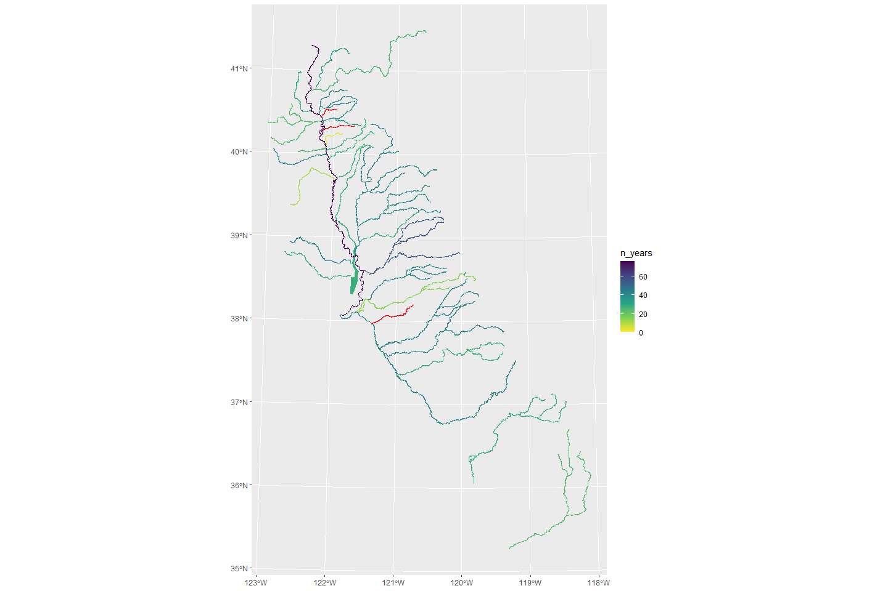

CDEC Overview
================
[Skyler Lewis](mailto:slewis@flowwest.com)
2024-01-16

## CDEC Summary

\[1 sentence description of data type (modeled or gage)…and source and
purpose.\]

- **Source:** California Department of Water Resources (DWR),
  aggregating hydrologic datasets from many sources including counties,
  water districts, CDFW, NPS, USFS, USGS, USACE, and DWR itself
- **Accessibility:** Public, open and accessible online
- **Coverage:** State of California, where data is available
- **Temporal Coverage:** \[max temporal range (min date - max date)\] -
  describe variation across gages if relevant
- **Spatial Coverage:** \[x out of x watersheds\]
- **Maintenance:** Is it maintained? And how often? By who (if different
  than source)
- **Contact: ** Data / Model Contact (think about if worth expanding to
  a larger list of people / orgs) - think about having table section
  below with projects/contacts
- **Utilized By:** What process is it used in: (list processes that use
  this data)

## Data Access

### Parameters

#### Stations

Station IDs follow a 3-digit format

Station Lookup:
`https://cdec.water.ca.gov/dynamicapp/staMeta?station_id={XXX}`

Station locator map:
<https://cdec.water.ca.gov/webgis/?appid=cdecstation>

Stations can be searched by river basin

#### Sensors

Refer to the station ID for which sensors are available at a particular
station.

Following are the sensor codes that report some variation of flow in
cfs. There are many other codes not listed here including stage,
temperature, turbidity, etc.

- **`20`** = **FLOW** = FLOW, RIVER DISCHARGE, CFS
- **`41`** = **MFLOW** = FLOW, MEAN DAILY, CFS
- **`165`** = **FLOW.XX** = FLOW, RIVER DISCHARGE PRECISE, CFS (rarely
  used)
- **`76`** = **INFLOW** = RESERVOIR INFLOW, CFS
- **`23`** = **OUTFLOW** = RESERVOIR OUTFLOW, CFS
- **`7`** = **REL SCH** = SCHEDULED RELEASE, CFS (manually reported)
- **\`110** = **DIVERSN** = FLOW, CANAL DIVERSION, CFS
- **`210`** = **AUXFLOW** = FLOW AUX, CFS
- **`8`** = **FNF** = FULL NATURAL FLOW, CFS (modeled)

#### Durations (timesteps)

A particular station sensor will have data available at one or more of
these duration types. The station lookup page will describe which
sensor-duration combinations are available.

- **`E`** = **EVENT** (typically 15-minute intervals)
- **`H`** = **HOURLY**
- **`D`** = **DAILY**

For example,
[BCK](https://cdec.water.ca.gov/dynamicapp/staMeta?station_id=BCK) has
flow data (sensor `20`) available at the 15-minute (duration `E`) and
hourly (duration `H`) timesteps, as well as in a summarized daily mean
format (sensor `41`, duration `D`).

### Data Access Options

#### CSV web service

`https://cdec.water.ca.gov/dynamicapp/req/CSVDataServlet?Stations={XXX}&SensorNums={XX}&dur_code={X}&Start={YYYY-MM-DD}&End={YYYY-MM-DD}`

#### Web API

Documented in PDFs linked at <https://cdec.water.ca.gov/queryTools.html>

#### Visual Interface

Real-time, daily, monthly query options:
<https://cdec.water.ca.gov/queryTools.html> /
<https://cdec.water.ca.gov/riv_flows.html>

Query most recent data by sensor for entire river basin:
<https://cdec.water.ca.gov/dynamicapp/getAll>
<https://cdec.water.ca.gov/dynamicapp/getAll?sens_num=%7BXX%7D>

#### R package `CDECRetrieve`

<https://github.com/FlowWest/CDECRetrieve>

## Spatial & Temporal Coverage

Plot and Chart that show coverage over watersheds, map here to show
temporal coverage for a site \# years or something Hilighting major
limitations, full time periods missing across many watersheds

``` r
river_basins <- read_csv("cdec_river_basins.csv")

cdec_station_sensor_list_filename <- "cdec_station_sensor_list.Rds"

if(!file.exists(cdec_station_sensor_list_filename)){
  
  cdec_station_sensor_list <- 
    river_basins |>
      filter(selected) |>
      mutate(stations = map(river_basin, possibly(function(x) {
        CDECRetrieve::cdec_stations(river_basin = x) |> 
          select(-river_basin, -elevation) # dropping elev, CDECRetrieve issue
        }, otherwise = NA))) |> 
      unnest(stations) |>
      mutate(datasets = map(station_id, possibly(function(x) {
        CDECRetrieve::cdec_datasets(station = x)
        }, otherwise = NA))) |>
      unnest(datasets)
  
  cdec_station_sensor_list |> saveRDS(cdec_station_sensor_list_filename)
  
} else {
  
  cdec_station_sensor_list <- readRDS(cdec_station_sensor_list_filename)
  
}
```

``` r
selected_sensors <- c(20, 41, 110)

cdec_station_sensors <- 
  cdec_station_sensor_list |> 
  mutate(min_wy = year(start %m+% months(3)),
         max_wy = year(end %m+% months(3))) |>
  filter(sensor_number %in% selected_sensors) |>
  st_as_sf(coords = c("longitude", "latitude"), crs="EPSG:4269") |>
  st_transform("EPSG:3310")

cdec_stations <- cdec_station_sensors |>
  group_by(station_id, name, county, operator) |> # also summarize list of sensors included
  summarize(sensors = list(unique(sensor_number))) |>
  st_union(by_feature = TRUE) 
```

    ## `summarise()` has grouped output by 'station_id', 'name', 'county'. You can
    ## override using the `.groups` argument.

``` r
#cdec_stations |> st_write("out/cdec_stations.shp", append=FALSE)
```

``` r
manual_station_list <- 
  read_csv("cdec_mainstem_stations.csv") |>
  janitor::clean_names() |>
  filter(!is.na(channel) & channel != "???") |>
  mutate(station_id = str_to_lower(station_id),
         mainstem = TRUE)
```

    ## Rows: 235 Columns: 5
    ## ── Column specification ────────────────────────────────────────────────────────
    ## Delimiter: ","
    ## chr (5): Section, Channel, Station ID, Station Name, Notes
    ## 
    ## ℹ Use `spec()` to retrieve the full column specification for this data.
    ## ℹ Specify the column types or set `show_col_types = FALSE` to quiet this message.

``` r
cdec_stations <- cdec_stations |>
  left_join(manual_station_list, join_by(station_id == station_id)) |>
  mutate(mainstem = coalesce(mainstem, FALSE))

cdec_station_sensors <- cdec_station_sensors |>
  left_join(manual_station_list, join_by(station_id == station_id)) |>
  mutate(mainstem = coalesce(mainstem, FALSE))
```

### Temporal Coverage

Version with only verified mainstem data

``` r
check_for_overlap <- function(wy, chan, sec) {
  cdec_station_sensors |>
    filter(channel == chan & section == sec) |>
    mutate(in_range = (wy >= min_wy) & (wy <= max_wy)) |>
    pull(in_range) |>
    any()
}

data_avail_by_water_year <- 
  expand_grid(water_year = seq(1949,2024,1), 
              manual_station_list |> select(channel, section) |> unique()) |>
  mutate(has_data = pmap_lgl(list(water_year, channel, section), check_for_overlap))

data_avail_by_water_year |>
  filter(!is.na(channel)) |>
  ggplot() + 
  facet_grid(rows = vars(channel), scales="free_y", space="free_y") +
  geom_tile(aes(x = factor(water_year), y = factor(section), fill = has_data)) +
  xlab("Water Year") + 
  ylab("") + 
  theme_minimal() + 
  theme(legend.position = "top", 
        axis.text.x = element_text(angle = 90, vjust = 0.5, hjust=1), 
        strip.text = element_blank(),
        panel.margin=unit(0,"lines")) + 
  scale_y_discrete(limits=rev, position="right") +
  scale_fill_manual(values = c("FALSE" = "white", "TRUE" = "darkgray"))
```

<!-- -->

``` r
station_table <- 
  cdec_station_sensors |>
  filter(mainstem) |>
  group_by(channel, section, station_id, station_name) |>
  summarize(start_date = min(start),
            end_date = min(end),
            sensors = list(unique(sensor_number)),
            ) |>
  mutate(freq_avail = paste(map(sensors, function(x) if_else(20 %in% x, "hourly", "daily")))) |>
  select(channel, section, station_id, station_name, start_date, end_date, freq_avail)
```

    ## `summarise()` has grouped output by 'channel', 'section', 'station_id'. You can
    ## override using the `.groups` argument.

``` r
station_table |> write_csv("out/station_table.csv")
```

### Spatial Coverage

``` r
# import a few different watershed files
# use intersection with these polys to detect if in the basin
watersheds_huc8 <- 
  st_read("shp/calw221_huc_8_selected.shp", as_tibble=TRUE) |>
  janitor::clean_names() |>
  st_transform("EPSG:3310") |>
  select(huc_8, huc_8_name, wshed_id)
```

    ## Reading layer `calw221_huc_8_selected' from data source 
    ##   `C:\Users\skylerlewis\Github\mwd-interoperable-flows\data-raw\shp\calw221_huc_8_selected.shp' 
    ##   using driver `ESRI Shapefile'
    ## Simple feature collection with 60 features and 5 fields
    ## Geometry type: POLYGON
    ## Dimension:     XY
    ## Bounding box:  xmin: -267648.5 ymin: -359620.2 xmax: 182116.2 ymax: 423148.3
    ## Projected CRS: NAD83 / California Albers

``` r
subwatersheds_huc12 <- 
  st_read("shp/wbd_subwatershed_selected.shp", as_tibble=TRUE) |>
  janitor::clean_names() |>
  st_transform("EPSG:3310")
```

    ## Reading layer `wbd_subwatershed_selected' from data source 
    ##   `C:\Users\skylerlewis\Github\mwd-interoperable-flows\data-raw\shp\wbd_subwatershed_selected.shp' 
    ##   using driver `ESRI Shapefile'
    ## Simple feature collection with 1737 features and 21 fields
    ## Geometry type: POLYGON
    ## Dimension:     XY
    ## Bounding box:  xmin: -123.0976 ymin: 34.77517 xmax: -117.9808 ymax: 41.82645
    ## Geodetic CRS:  NAD83

``` r
subwatersheds_calw221 <-
  st_read("shp/calw221_selected.shp", as_tibble=TRUE) |>
  janitor::clean_names() |>
  st_transform("EPSG:3310")
```

    ## Reading layer `calw221_selected' from data source 
    ##   `C:\Users\skylerlewis\Github\mwd-interoperable-flows\data-raw\shp\calw221_selected.shp' 
    ##   using driver `ESRI Shapefile'
    ## Simple feature collection with 3005 features and 38 fields
    ## Geometry type: POLYGON
    ## Dimension:     XY
    ## Bounding box:  xmin: -267648.5 ymin: -359620.2 xmax: 182116.2 ymax: 423148.3
    ## Projected CRS: NAD83 / California Albers

``` r
watershed_labels <- 
  st_read("shp/wbd_huc10_group_by_river_name.shp", as_tibble=TRUE) |>
  janitor::clean_names() |>
  st_transform("EPSG:3310") |>
  rename(river_basin = river_name)
```

    ## Reading layer `wbd_huc10_group_by_river_name' from data source 
    ##   `C:\Users\skylerlewis\Github\mwd-interoperable-flows\data-raw\shp\wbd_huc10_group_by_river_name.shp' 
    ##   using driver `ESRI Shapefile'
    ## Simple feature collection with 40 features and 1 field
    ## Geometry type: POLYGON
    ## Dimension:     XY
    ## Bounding box:  xmin: -123.0976 ymin: 34.77517 xmax: -117.9808 ymax: 41.82645
    ## Geodetic CRS:  NAD83

``` r
# import river and creek stream lines
# use intersection with buffered flowline shapefile to detect if on the mainstem
stream_flowlines <- 
  st_read("shp/ca_streams_selected.shp", as_tibble=TRUE) |>
  janitor::clean_names() |>
  st_zm() |>
  st_transform("EPSG:3310") |>
  mutate(label = coalesce(name, paste0("Tributary of ",down_name)))
```

    ## Reading layer `ca_streams_selected' from data source 
    ##   `C:\Users\skylerlewis\Github\mwd-interoperable-flows\data-raw\shp\ca_streams_selected.shp' 
    ##   using driver `ESRI Shapefile'
    ## Simple feature collection with 87 features and 20 fields
    ## Geometry type: LINESTRING
    ## Dimension:     XYM
    ## Bounding box:  xmin: -257718.9 ymin: -305264.9 xmax: 171875.1 ymax: 386351.3
    ## m_range:       mmin: 0 mmax: 597993.6
    ## Projected CRS: NAD83 / California Albers

``` r
bypass_polys <- 
  st_read("shp/yolo_sutter_bypass_extents.shp", as_tibble=TRUE) |>
  janitor::clean_names() |>
  st_transform("EPSG:3310") |>
  mutate(name = map(area_name, function(x) str_split_1(x, " - ")[1])) |> 
  unnest() |>
  group_by(name) |>
  summarize() |>
  st_union(by_feature = TRUE)
```

    ## Reading layer `yolo_sutter_bypass_extents' from data source 
    ##   `C:\Users\skylerlewis\Github\mwd-interoperable-flows\data-raw\shp\yolo_sutter_bypass_extents.shp' 
    ##   using driver `ESRI Shapefile'
    ## Simple feature collection with 8 features and 7 fields
    ## Geometry type: POLYGON
    ## Dimension:     XY
    ## Bounding box:  xmin: 6554790 ymin: 1876136 xmax: 6688689 ymax: 2368307
    ## Projected CRS: NAD83(2011) / California zone 2 (ftUS)

#### Geographic distribution of sensors

``` r
if (interactive()) {
  leaflet::leaflet() |> 
  leaflet::addTiles() |> 
  leaflet::addPolygons(data=st_transform(watershed_labels, "EPSG:4326"), label=~river_basin, color="gray") |>
  leaflet::addPolygons(data=st_transform(bypass_polys, "EPSG:4326"), label=~name, fillColor="darkblue", opacity=0.5, color=NA) |>
  leaflet::addPolylines(data=st_transform(stream_flowlines, "EPSG:4326"), label=~label, color="darkblue") |>
  leaflet::addCircleMarkers(data=st_transform(cdec_stations, "EPSG:4326"), 
                            label=~paste(station_id, name, operator, paste(sensors), sep="<br>") |> lapply(htmltools::HTML),
                            color = ~if_else(mainstem, "darkred", "darkgray")) 
} else {
 ggplot() + 
    geom_sf(data=watershed_labels, color="gray") + 
    geom_sf(data=bypass_polys, fill="darkblue", color=NA, alpha=0.5) +
    geom_sf(data=stream_flowlines, color="darkblue") + 
    geom_sf(data=cdec_stations, aes(color=mainstem)) +
    scale_color_manual(values = c("TRUE" = "darkred", "FALSE" = "darkgray"))
}
```

<!-- -->

#### Years of data available by stream

``` r
first_year_available <- data_avail_by_water_year |>
  filter(has_data) |>
  group_by(channel, water_year) |>
  summarize(has_data = any(has_data)) |>
  group_by(channel) |>
  summarize(first_year = min(water_year),
            n_years = n())
```

    ## `summarise()` has grouped output by 'channel'. You can override using the
    ## `.groups` argument.

``` r
river_names <- watershed_labels$river_basin |> unique() |> c("Yolo Bypass", "Sutter Bypass")
match_name <- function(x) paste0(river_names[which(str_detect(x, river_names))][1],"")
flowlines_first_year_available <- 
  stream_flowlines |>
  mutate(
    river_name = coalesce(name, down_name),
    matched = map_lgl(river_name, function(x) any(str_detect(x, river_names))),
    river_name = if_else(matched, map_chr(river_name, match_name), NA)) |>
  filter(!is.na(river_name)) |>
  group_by(river_name) |>
  summarize() |>
  st_union(by_feature = TRUE) |>
  left_join(first_year_available, by = join_by(river_name == channel)) |>
  mutate(n_years = coalesce(n_years, 0)) 

bypasses_first_year_available <- 
  bypass_polys |>
  filter(name %in% c("Yolo Bypass", "Sutter Bypass")) |>
  left_join(first_year_available, by = join_by(name == channel)) |>
  mutate(n_years = coalesce(n_years, 0)) 

ggplot() +
  geom_sf(data = bypasses_first_year_available, aes(fill = n_years), color=NA) + 
  geom_sf(data = bypasses_first_year_available |> filter(n_years==0), fill="red", color=NA) +
  geom_sf(data = flowlines_first_year_available, aes(color = n_years)) + 
  geom_sf(data = flowlines_first_year_available |> filter(n_years==0), color="red") +
  scale_color_viridis_c(direction=-1, aesthetics = c("color", "fill"))
```

<!-- -->

## Quality Checks

\[CONDITIONALLY NEEDED - if gage / if not already described in model
section\] What quality assurance checks are implemented by monitoring
agency What quality control checks are implemented by monitoring agency

Error codes - May differ by station and sensor

## Data use and limitations

(build out once we play around with the data a bit more) Pros and cons
table for each use case

## Questions for Data Experts

- Please list any questions about the data source.
