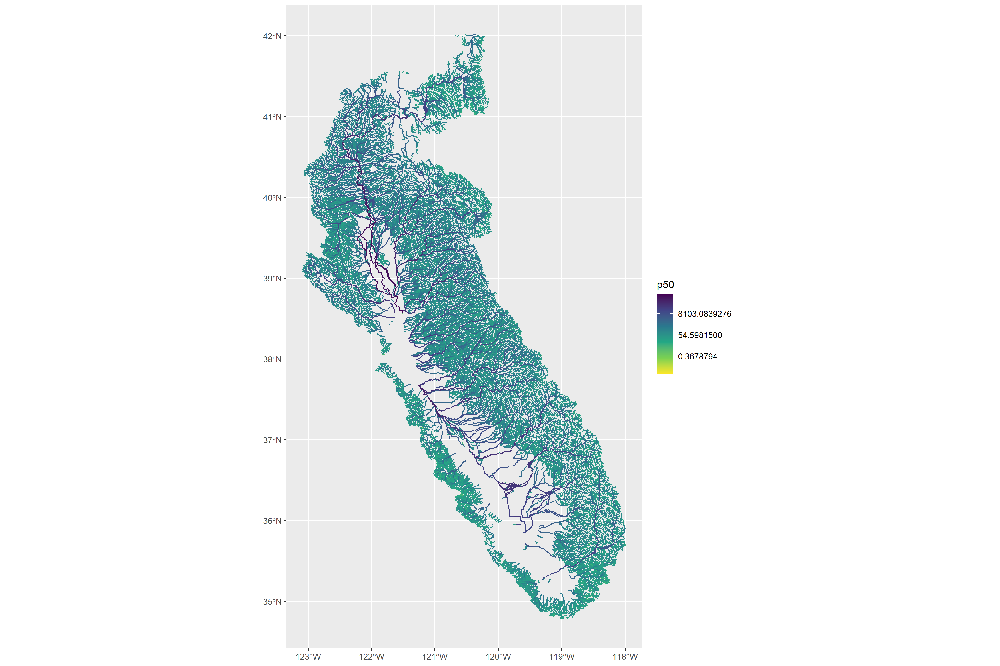
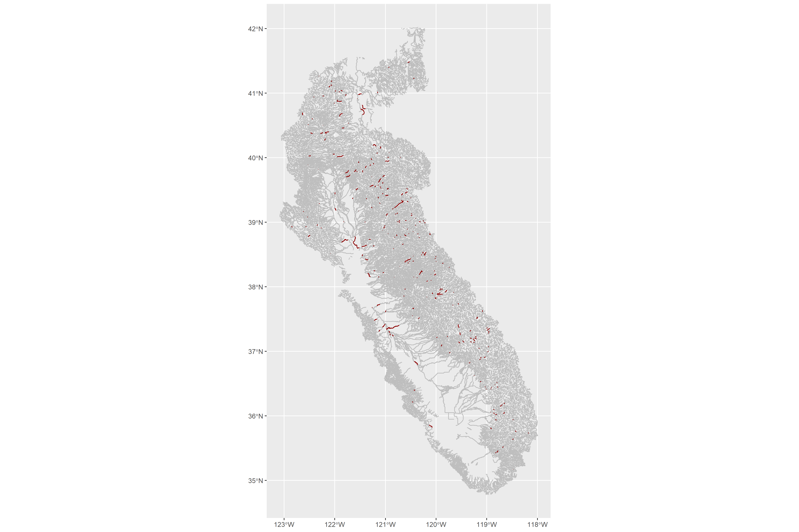

Natural Flows Overview
================
[Skyler Lewis](mailto:slewis@flowwest.com)
2024-02-05

- [Natural Flows Summary](#natural-flows-summary)
- [Natural Flows Model Summary](#natural-flows-model-summary)
  - [Monthly Dataset (California Unimpaired Flows
    Database)](#monthly-dataset-california-unimpaired-flows-database)
  - [Functional Flow Metrics](#functional-flow-metrics)
  - [Architecture](#architecture)
  - [Accessibility](#accessibility)
  - [Update procedure](#update-procedure)
  - [QA/QC procedures](#qaqc-procedures)
  - [Data Inputs](#data-inputs)
  - [Model Outputs](#model-outputs)
- [Data Access](#data-access)
  - [Monthly Dataset](#monthly-dataset)
  - [Functional Flow Metrics (FFM)
    Dataset](#functional-flow-metrics-ffm-dataset)
- [Spatial & Temporal Coverage](#spatial--temporal-coverage)
- [Quality Checks](#quality-checks)
- [Data use and limitations](#data-use-and-limitations)
- [Questions for Data Experts](#questions-for-data-experts)

## Natural Flows Summary

\[1 sentence description of data type (modeled or gage)…and source and
purpose.\]

- **Source:** \[agency collecting or producing data\]
- **Accessibility:** (public, open and accessible online, if it is a
  model, can you run it independently?)
- **Coverage:**
- **Temporal Coverage:** The temporal range of model results is 1950 -
  2023.
- **Spatial Coverage:** Model results are available for all NHDPlusV2
  flowlines (`comid`s) in the Central Valley and the rest of California.
  The reliability of results varies based on the spatial and temporal
  distribution of USGS streamgages which were used to train the model.  
- **Maintenance:** Is it maintained? And how often? By who (if different
  than source)
- **Contact:** Data / Model Contact (think about if worth expanding to a
  larger list of people / orgs) - think about having table section below
  with projects/contacts
- **Utilized By:** What process is it used in: (list processes that use
  this data)

California Environmental Flows Framework <https://ceff.ucdavis.edu/>

Detailed in the [technical report](https://ceff.ucdavis.edu/tech-report)

## Natural Flows Model Summary

\[CONDITIONALLY NEEDED - If it is modeled data - follow with a model
summary\] Couple sentence overview of model synthesizing what you know
about modeled data source. Then subsections to describe the what.

There are two types of model output.

- **Monthly Dataset (California Unimpaired Flows Database)**[^1]: The
  core output of the Natural Flows project. A random forest model was
  used to predict unimpaired flows at a monthly timestep for all stream
  segments in California.

- **Functional Flow Metrics** [^2] [^3]: Calculation of the functional
  flows metrics, as defined by the Californai

### Monthly Dataset (California Unimpaired Flows Database)

\[more description here\]

#### Alternatives

The Department of Water Resources (DWR) released its own model of
unimpaired flows for the Central Valley. This product is described in
the technical report, *[Estimates of Natural and Unimpaired Flows for
the Central Valley of California: WY
1922-2014](https://data.ca.gov/dataset/estimates-of-natural-and-unimpaired-flows-for-the-central-valley-of-california-wy-1922-2014)*.
Unimpaired flows data can be retrieved via the CDEC system via sensor
code `8` (FNF, FULL NATURAL FLOW, CFS). Refer to CDEC documentation for
details.

### Functional Flow Metrics

The model divides the water year into the dry season (low base flows),
wet season (higher base flows beginning with a fall pulse flow and
punctuated by various peak flows), and spring recession period (the
transition back from high to low flows).

Five categories of functional flow metrics are reported, based on the
five flow components described by Yarnell et al, 2015[^4]. (Descriptive
text from the Natural Flows application.)

- **dry-season base flow.** Dry-season base flows support native species
  during the dry-season period when water quality and quantity limit
  habitat suitability.

- **fall pulse flow.** The first major storm event following the dry
  season. These flows represent the transition from dry to wet season
  and serve important functions, such as moving nutrients downstream,
  improving water stream flow water quality, and signaling species to
  migrate or spawn.

- **wet-season base flow.** Wet-season base flows support native species
  that migrate through and over-winter in streams.

- **peak flow.** Peak flow events transport a significant portion of
  sediment load, inundate floodplains, and maintain and restructure
  river corridors.

- **spring recession flow.** Spring recession flows represent the
  transition from high to low flows, provide reproductive and migratory
  cues, and redistribute sediment.

<figure>

<figcaption aria-hidden="true">Functional Flows (Yarnell et
al. 2020)</figcaption>
</figure>

### Architecture

(What type of model is it?)

### Accessibility

(How accessible is the documentation, and how easy is it to interpret)

### Update procedure

Predicted monthly flows have been updated several times, as described in
the [Methods](https://rivers.codefornature.org/#/science) section. For
example, on June 2022 an updated set of PRISM monthly climate data was
incorporated, the stream network accumulation method was updated, and
other computational methods were revised.

### QA/QC procedures

### Data Inputs

- Data needed to run
- Timestep of each input

### Model Outputs

- File source
- Timestep

## Data Access

Data can be accessed in two ways.

- API documented at <https://rivers.codefornature.org/#/data>

  - Monthly data: Query CSV via GET request at
    `https://flow-api.codefornature.org/v2/stream/?comids=...&...` for a
    list of COMIDs or all COMIDs. Filter parameters for years, months,
    statistics, and variables are defined in the API documentation. POST
    requests are also possible via RESTful API.

  - Functional Flow Metrics: Query CSV via GET request
    `https://flow-api.codefornature.org/v2/ffm/?comids=...&...` for a
    list of COMIDs or all COMIDs. Filter parameters for metrics, water
    year types, modleing values, and gage data are defined in the API
    documentation. POST requests are also possible via RESTful API.

- Direct download

  - Monthly data: Not available for direct download
  - Functional flow metrics: full ZIP download explored below

### Monthly Dataset

Queries output a longform CSV of the following form.

- `comid` (string): NHDPlusV2 common identifier
- `statistic` (string): statistics, e.g. max, mean, median, min
- `variable` (string): percentile of model runs
- `year` (integer): model year
- `month` (integer): model month
- `value` (number): modelled value

### Functional Flow Metrics (FFM) Dataset

The data table is long form, with one row per flowline (`comid`), per
water year type (`wyt`), per functional flow metric (`ffm`). The raw
table takes the following form, with descriptive text sourced from the
Natural Flows website.

- `comid` (string): NHDPlusV2 common identifier
- `ffm` (string): functional flows metrics code (see …)
- `wyt` (string): water year type
- `p10`, `p25`, `p50`, `p75`, `p90`: modeling values for 10, 25, 50, 75
  and 90 percentile of runs, use p50 for the most likely value
- `unit`: measurement unit for p10, p25, p50, p75, and p90
- `source`: source of p10, p25, p50, p75, and p90

For reaches with streamgages, an additional set of rows and functional
flow metrics are included, reporting the metrics derived from the
observed gage data rather than the model result. For these rows
(`source=="observed"`), the following fields are also populated.

- `gage_id`: USGS gage id where observed
- `observed_years`: number of years of observations
- `observed_year_start`: first water year of observations
- `observed_year_end`: last water year of observations
- `alteration`: alteration compared to modelled value

The following attributes are included in the table, with values reported
as separate variables for the percentiles `p10`, `p25`, `p50`, `p75`,
`p90`. Some attributes are recorded for the overall water year type
`all` while others are reported for each of `dry`, `moderate`, `wet`.

Metrics are broken down into the following flow components, each
reporting some sort of magnitude, timing, and duration information.

- **`ds` = dry-season base flow.** Reported separately for `dry`,
  `moderate`, `wet` water year types.
  - `ds_mag_50` = **dry-season baseflow** = Calculated as 50th
    percentile of daily flow within dry season (cfs)
  - `ds_mag_90` = **dry-season high baseflow** = Calculated as 90th
    percentile of daily flow within dry season (cfs)
  - `ds_tim` = **dry-season start** = Start date of dry season (water
    year day)
  - `ds_dur` = **dry-season duration** = Number of days from start of
    dry season to start of wet season (days)
- **`fa` = fall pulse flow.** Reported separately for `dry`, `moderate`,
  `wet` water year types.
  - `fa_mag` = Peak magnitude of fall pulse event (maximum daily peak
    flow during event) (cfs)
  - `fa_tim` = Date of fall pulse event peak (water year day)
  - `fa_dur` = Duration of fall pulse event (days)
- **`wet` = wet-season base flow.** Reported separately for `dry`,
  `moderate`, `wet` water year types.
  - `wet_bfl_mag_10` = Wet-season base flow, calculated as 10th
    percentile of daily flows within the wet season (cfs)
  - `wet_bfl_mag_50` = Wet-season median flow, calculated as 50th
    percentile of daily flows within the wet season (cfs)
  - `wet_tim` = Start date of wet season (water year day)
  - `wet_bfl_dur` = Number of days from start of wet season to start of
    spring recession period (days)
- **`peak` = peak flow.** Reported separately for `2`-year, `5`-year,
  and `10`-year recurrence intervals (`#`).
  - `peak_#` = Peak flow magnitude for the specified recurrence interval
    (cfs)
  - `peak_dur_#` = Cumulative number of days in which this peak flow
    magnitude is exceeded within a season (days)
  - `peak_freq_#` = Number of times that this peak flow magnitude is
    exceeded within a season (number of occurrences)
- **`sp` = spring recession flow.** Reported separately for `dry`,
  `moderate`, `wet` water year types.
  - `sp_tim` = Start date of spring season, defined as 4 days after last
    wet-season peak (water year day)
  - `sp_mag` = Daily flow on start date of spring recession period.
    (cfs)
  - `sp_dur` = Number of days from start of spring recession period to
    start of dry season (days)
  - `sp_roc` = Recession rate, defined as median daily rate of change
    (%) over decreasing periods during the spring recession period

## Spatial & Temporal Coverage

Plot and Chart that show coverage over watersheds, map here to show
temporal coverage for a site \# years or something Highlighting major
limitations, full time periods missing across many watersheds

Spatial coverage of flowlines with model data (showing 10-year peak flow
p50 value as an example)

``` r
st_zm(flowlines_sf) |>
  inner_join(filter(naturalflows_tb, ffm=="peak_10" & source=="model")) |>
  arrange(p50) |>
  ggplot() + geom_sf(aes(color=p50)) + scale_color_viridis_c(trans="log", direction=-1)
```

    ## Joining with `by = join_by(comid)`

<!-- -->

Spatial coverage of observed (training) data:

``` r
st_zm(flowlines_sf) |>
  inner_join(filter(naturalflows_tb, ffm=="peak_10" & source=="observed")) |>
  ggplot() + geom_sf(data=st_zm(flowlines_sf), color="gray") + geom_sf(color="darkred")
```

    ## Joining with `by = join_by(comid)`

<!-- -->

## Quality Checks

\[CONDITIONALLY NEEDED - if gage / if not already described in model
section\] What quality assurance checks are implemented by monitoring
agency What quality control checks are implemented by monitoring agency

## Data use and limitations

(build out once we play around with the data a bit more) Pros and cons
table for each use case

flow frequency - geomorphology, flood modeling - alternative to making
weighted B17C estimates

watershed scale habitat modeling

floodplain restoration design as input to H&H models

understanding impacts of dams on natural flows, determing dam release
requirements

filling in data gaps for ungaged streams

## Questions for Data Experts

- Please list any questions about the data source.

[^1]: Julie K.H. Zimmerman, Daren M. Carlisle, Jason T. May, Kirk R.
    Klausmeyer, Theodore E. Grantham, Larry R. Brown, Jeanette K.
    Howard. *California Unimpaired Flows Database v2.1.2*, 2023. The
    Nature Conservancy. San Francisco CA.
    <https://rivers.codefornature.org/>

[^2]: California Environmental Flows Working Group (CEFWG). California
    Natural Flows Database: *Functional flow metrics v1.2.1*, May 2021.
    <https://rivers.codefornature.org/>

[^3]: Grantham, T. E., Carlisle, D. M., Howard, J., Lane, B., Lusardi,
    R., Obester, A., Sandoval-Solis, S., Stanford, B., Stein, E. D.,
    Taniguchi-Quan, K. T., Yarnell, S. M., & Zimmerman, J. K. (2022).
    Modeling functional flows in California’s rivers. *Frontiers in
    Environmental Science* 10.
    <https://doi.org/10.3389/fenvs.2022.787473>

[^4]: Sarah M. Yarnell, Eric D. Stein, J. Angus Webb, Theodore Grantham,
    Rob A. Lusardi, Julie Zimmerman, Ryan A. Peek, Belize A. Lane,
    Jeanette Howard, Samuel Sandoval-Solis. A functional flows approach
    to selecting ecologically relevant flow metrics for environmental
    flow applications. *River Research and Applications* 36(2): 318-324.
    February 2020. <https://doi.org/10.1002/rra.3575>
